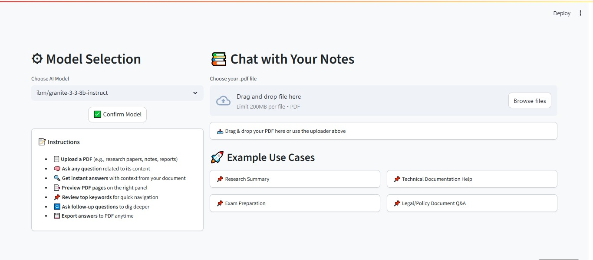
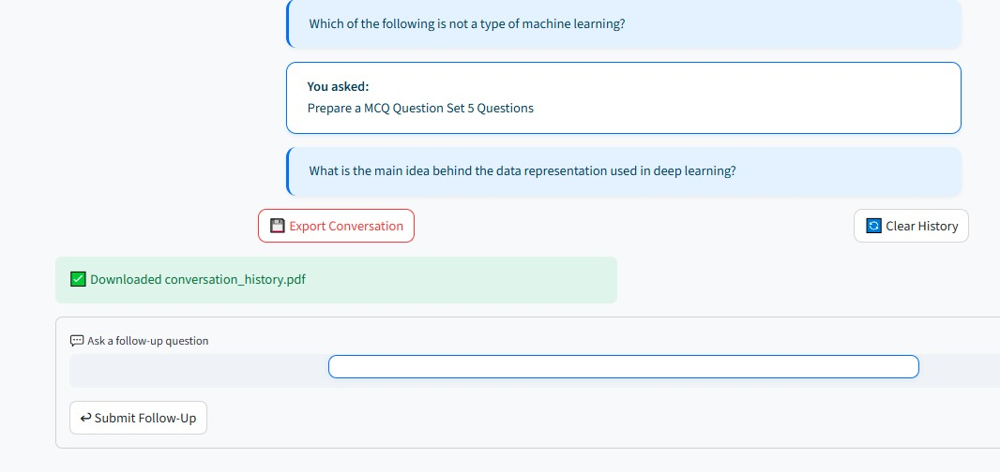

# 
📄 Chat with Your Notes — PDF Q&A Bot

An <strong>AI-powered PDF assistant</strong> that lets users upload documents and interact with them using natural language.  
Built with <strong>Streamlit, LangChain, and IBM watsonx</strong>, this tool converts static PDFs into an intelligent conversational interface.

---

# 📸 Application Screenshots

## 🏠 Home Page

*Clean interface where users begin interacting with the PDF assistant.*

---

## 📁 File Upload

*Upload any PDF document such as lecture notes, research papers, or manuals.*

---

## 🔍 Keywords Extracted

*Important keywords are automatically extracted to help understand document topics.*

---

## 💬 Conversation with the Document

*Users can ask questions and receive contextual answers from the uploaded PDF.*

---

# 📝 Project Description

**Chat with Your Notes** transforms traditional PDF documents into an **interactive AI knowledge assistant**.

Instead of manually searching through long documents, users can simply ask questions and receive **context-aware responses generated by a Large Language Model (LLM).**

This makes it especially useful for:

- 🎓 Students reviewing lecture notes  
- 📚 Researchers exploring academic papers  
- 💼 Professionals analyzing reports and manuals  

---

# 🚀 Features

- 📁 **Upload Any PDF**  
  Import lecture notes, books, manuals, or research papers.

- 👀 **Document Preview**  
  Quickly preview the first few pages of the uploaded PDF.

- 🔍 **Keyword Extraction**  
  Automatically extracts important keywords from the document.

- 💬 **Ask Questions About the PDF**  
  Ask natural language questions and receive AI-generated answers.

- 🔄 **Conversational Memory**  
  Supports follow-up questions using chat history.

- 🧠 **Multiple AI Models**  
  Choose between **IBM watsonx** or **OpenAI models**.

- 📄 **Export Chat Session**  
  Download the entire Q&A conversation as a **PDF file**.

- 🗑 **Clear Chat History**  
  Reset the conversation anytime.

---

# 🛠 Technologies Used

| Category | Technologies |
|--------|-------------|
| Programming | Python |
| UI Framework | Streamlit |
| LLM Framework | LangChain |
| AI Models | IBM watsonx / OpenAI |
| Vector Database | FAISS |
| PDF Processing | PyMuPDF (fitz) |
| Embeddings | HuggingFace |
| Environment Management | python-dotenv |

---

# 🧠 System Workflow

1️⃣ User uploads a **PDF document**  
2️⃣ The system extracts text using **PyMuPDF**  
3️⃣ The document is **split into chunks**  
4️⃣ Chunks are converted into **vector embeddings**  
5️⃣ Stored in **FAISS vector database**  
6️⃣ User asks a question  
7️⃣ Relevant chunks are retrieved  
8️⃣ The LLM generates a **context-aware answer**

---

